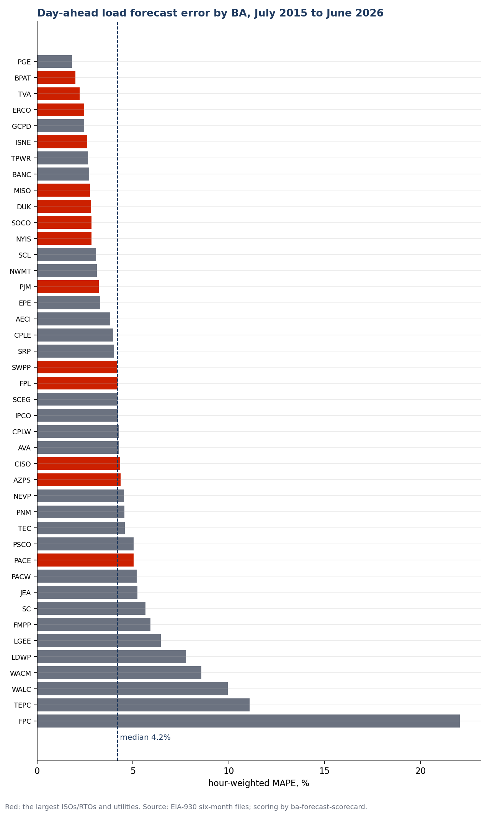
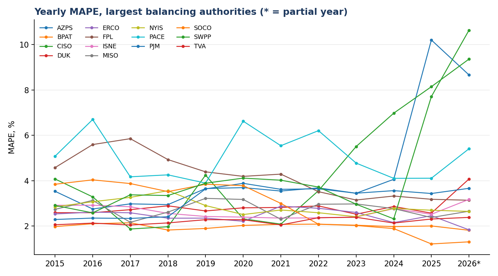
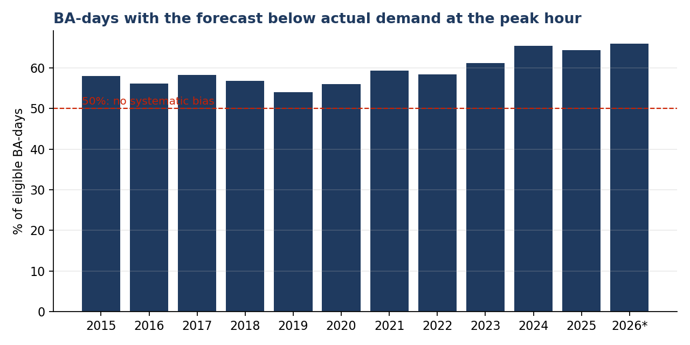
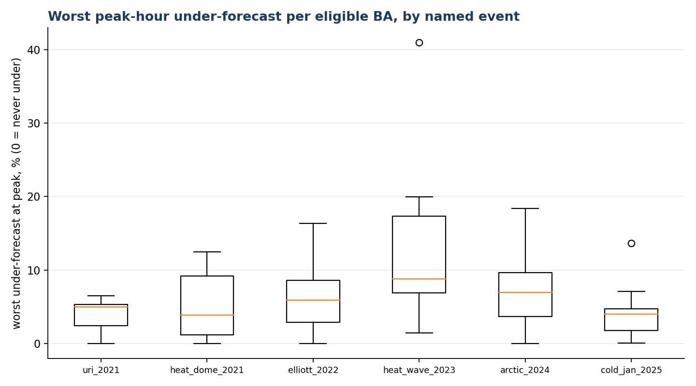

# How well do U.S. balancing authorities forecast their own load? A 2015–2026 scorecard from EIA-930

**Cardinal Grid Notes · No. 1 · Draft generated {generated} · Data {first_date} to {last_date} · Code: [`analysis.py`](analysis.py) · Scorer: [ba-forecast-scorecard](https://github.com/cardinalgrid/ba-forecast-scorecard) v{version}**

> Status: **draft for review**. Numbers and figures in this note are produced by `analysis.py` from public data; nothing here is typed by hand. The note will be published at [cardinalgrid.com/notes](https://cardinalgrid.com/notes) and archived with a DOI once reviewed.

## The question

Every U.S. balancing authority (BA) publishes, through the U.S. Energy Information Administration's Form EIA-930, two hourly numbers: the demand that actually occurred, and the day-ahead demand forecast the BA itself submitted the day before. BAs are the entities that keep generation, load and interchange in balance in real time and buy reserves against their own forecast. In the U.S. that role is held by ISOs/RTOs such as ERCOT and PJM, by vertically integrated utilities such as Duke Energy, and by federal entities such as TVA; the scorecard measures all of them on the same footing. Since July 2015 that pair has been public for every BA in the Lower 48. So the question "how well do operators forecast their own load?" does not need any operator's cooperation. It needs a script.

This matters because the day-ahead forecast is what operators commit generation and buy reserves against. When it is too low, reserves are short. FERC and NERC documented day-ahead load under-forecasts of up to 11.6% at one BA during Winter Storm Elliott, contributing to firm load shed ([FERC/NERC 2023](https://www.ferc.gov/news-events/news/ferc-nerc-release-final-report-lessons-winter-storm-elliott)); NERC's 2025 Long-Term Reliability Assessment states that traditional load forecasting methods may not be sufficient for the load growth ahead ([NERC 2026](https://www.nerc.com/globalassets/our-work/assessments/nerc_ltra_2025.pdf)).

## What was measured

- Source: EIA-930 six-month balance files, {first_date} to {last_date}, {n_total} BAs in the files.
- What the two series are, in EIA's own terms: "hourly integrated values in megawatts by hour ending time", i.e. average MW over each hour, time-stamped in UTC. `D` is actual demand; `DF` is the "day-ahead demand forecast", which each BA's daily file must contain as "yesterday's hourly day-ahead demand forecast for today". Files are due by 7:00 a.m. Eastern.
- What EIA does not specify: the forecasting method, its inputs, or the time of day the forecast is produced. The instructions say a BA that does not produce a comparable forecast in the normal course of business is not required to build one for EIA and should "report the day-ahead demand forecast generated in the normal course of business". The forecast is therefore each BA's operational day-ahead forecast, as it was, made with whatever data the BA had at its own cut-off time.
- For each BA-day with at least 20 valid hours: MAPE, bias, RMSE, and the error at the hour of the actual daily peak (`peak_hour_pct_error`, negative = forecast below actual). {ba_days} BA-days and {hours} hours were scored.
- Data-quality rules, applied before any error is computed: hours with demand or forecast ≤ 0 are excluded; hours where forecast/demand falls outside [1/2, 2] are flagged as implausible (a zero, a unit error, a stale value) and excluded. {implausible} hours were flagged. EIA-imputed demand values were {imputed} of scored hours.
- Ranking eligibility: at least 180 scored days, mean demand ≥ 500 MW, and a median daily bias within ±25% (beyond that, forecast and demand are not describing the same quantity). {n_scored} BAs report both series; **{n_eligible} are eligible**.

Full definitions are in the scorer's [README](https://github.com/cardinalgrid/ba-forecast-scorecard#metric-definitions).

## Findings

### 1. Typical day-ahead error is a few percent, with a long tail

Across eligible BAs, the **demand-weighted MAPE is {dw_mape}**; the median BA sits at {med_mape}. The best five: {top}. The worst five: {bottom}.



The tail is not, for the most part, bad forecasting. The BAs with the highest MAPE share a pattern of reported series with unit errors, zeros or stale values that survive the loose implausibility band. This is the reason the scorecard carries a data-quality layer, and it is the subject of Note 6.

### 2. The largest operators

| Rank | BA | Region | MAPE | Bias | Mean abs. error at peak hour | 1-in-100-day under-forecast at peak |
|---|---|---|---|---|---|---|
{major_rows}



Two trends in this chart deserve their own note before any conclusion is drawn: the rise in CISO's and SWPP's yearly MAPE since 2023, and AZPS's 2015 value. Each could be forecasting, a change in what the BA reports, or both. {partial_year_note}

### 3. At the peak hour, forecasts lean low

On **{under_share} of eligible BA-days the forecast was below actual demand at the hour of the daily peak.** If forecasts were unbiased, that share would be near 50%, and it has drifted upward since 2019. One eligible BA-day in a hundred under-forecasts the peak by more than **{p99}**. Under-forecasting at the peak is the direction that costs reserves and, in an emergency, load.



### 4. Named events

Worst peak-hour under-forecast by any eligible BA during each event window (fixed dates from the public inquiries):

| Event | BA | Worst under-forecast at peak |
|---|---|---|
{event_rows}



The largest single eligible BA-day miss in the whole period is {worst_ba} on {worst_date}: forecast {worst_pct} below a {worst_mw} MW peak. Single-day extremes can still be data problems; the 1-in-100-day figure above is the robust one.

## What this does not show

- Forecasts are as submitted to EIA and may differ from what operators used internally; EIA's revision rules apply to measured data, not to the forecast.
- The forecast horizon is not the same for every BA. A forecast closed at 9 a.m. the day before covers 15 to 39 hours ahead; one closed at 5 p.m. covers 7 to 31. EIA does not record the cut-off time, so part of the difference between BAs is horizon, not skill. Comparisons across BAs should be read with that in mind; comparisons of the same BA over time are not affected.
- Several small BAs' series contain errors the implausibility band does not catch. Their MAPE says "data or forecast problem", not "forecast problem".
- Event windows are fixed dates, not weather-defined extreme days. Weather attribution comes with v0.2 of the scorer.
- No BA has been contacted for comment. Corrections are welcome: open an issue on the [scorer repository](https://github.com/cardinalgrid/ba-forecast-scorecard/issues).

## Reproduce

```bash
pip install -e ../../ba-forecast-scorecard matplotlib
python analysis.py --rebuild     # downloads the EIA-930 files (~1 GB) and rebuilds everything
```

## Cite

Guerra Filho, R. W. C. ([ORCID 0000-0001-6699-9951](https://orcid.org/0000-0001-6699-9951)) (2026). *How well do U.S. balancing authorities forecast their own load? A 2015–2026 scorecard from EIA-930.* Cardinal Grid Notes, No. 1. DOI: to be assigned on publication.

*Text and figures CC BY 4.0; code Apache-2.0. Analyses rely on public data only and represent the author's own views.*
