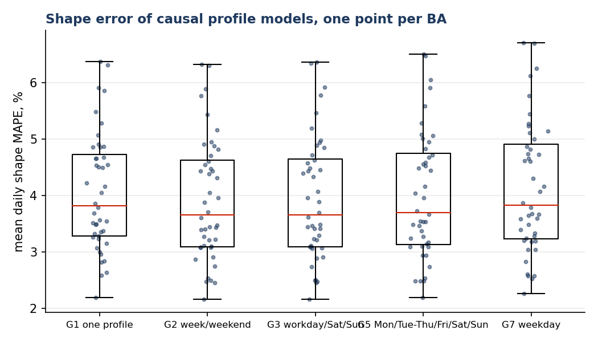
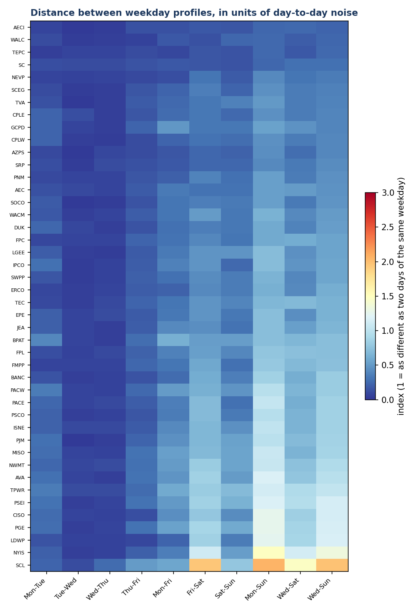
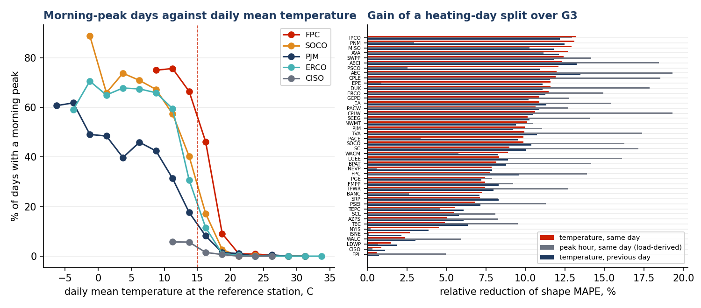

# Seven daily profiles, three, or none? What the load shape of 44 U.S. balancing authorities says about weekdays, holidays and weather

**Cardinal Grid Notes · No. 2 · Draft generated 2026-09-11 · Data 2015-07-01 to 2026-06-30 · Code: [`analysis.py`](analysis.py)**

> Draft, not yet published. All numbers and figures are generated by `analysis.py` from the public EIA-930 data.

## The question

Every method that works on a load series needs a notion of the "typical day": anomaly detectors compare a reading with it, repair routines fill gaps from it, and short-term forecasters use it as a calendar feature. The usual choice is to keep one profile per weekday, seven in all. The cheaper choice is three: workday, Saturday, Sunday. Both then need a list of special days, holidays first of all, that follow no profile.

Which choice is right is an empirical question, and with EIA-930 it can be answered for every balancing authority (BA) in the Lower 48 at once. This note does that, and along the way finds that the calendar is not the main thing that changes the shape of a day.

## What was measured

- Hourly demand from the EIA-930 balance files, 2015-07-01 to 2026-06-30, in each BA's **local time**. 44 BAs with at least 600 valid days and a mean demand of 500 MW or more; 172,741 BA-days in total. Days with fewer than 23 valid hours, or with an hour below 20% or above 300% of the day's mean, were dropped (631 days).
- The **shape** of a day is its 24 hourly values divided by the day's mean. Level (how much energy the day used) is set aside; this note is about shape only.
- Five ways of grouping days, all evaluated the same way: the profile for day *d* is the hour-by-hour median of the shapes of the days in the same group during the previous *W* weeks, excluding a fixed list of special days. Nothing after day *d* is used. The error is the MAPE between that profile and the day's actual shape, over 24 hours.

| Model | Groups |
|---|---|
| G1 | one profile |
| G2 | week / weekend |
| G3 | workday / Saturday / Sunday |
| G5 | Monday / Tuesday to Thursday / Friday / Saturday / Sunday |
| G7 | one per weekday |

- Special days (a priori): U.S. federal holidays and their observed days, the day after Thanksgiving, 24 and 31 December, and Super Bowl Sunday. 4.3% of BA-days.
- A **heating/cooling regime**, read two ways. From the load: a day is a *morning-peak* day if its highest hour is 12:00 or earlier, which in practice means an electric-heating morning. From the weather: the daily mean temperature at one NOAA airport station per BA (hourly ISD-Lite observations, [`weather.py`](weather.py)) classifies a day as heating (below 15 °C), mild, or cooling (above 22 °C). The 15 °C threshold is the one that best separates morning-peak days from the rest, and it is nearly the same in every BA.

## Findings

### 1. Seven weekday profiles are worse than three, everywhere

With an 8-week window, G7 has a higher shape error than G3 in **every one of the 44 BAs** (44 with a 95% bootstrap interval entirely below zero; mean loss 4.3% relative). G5 is also worse than G3 (1.8%). The reason is not that weekdays are identical; it is that they are nearly identical while the seasons are not. Tuesday, Wednesday and Thursday profiles differ from each other by 0.06 units of day-to-day noise (median across BAs); Monday and Friday differ from mid-week by 0.19 and 0.19. Splitting the workdays into five groups divides the reference set by five to remove a difference smaller than the noise.




### 2. Recency matters more than any calendar split

The error of every model rises steadily with the length of the reference window: G3 goes from 3.38% at 2 weeks to 5.13% at 16 weeks. The best model in the whole grid is **G3 with a 2-week window** (3.38%). A single profile from the last 3 weeks (G1, 3.50%) beats three profiles from the last 6 weeks (3.67%). The daily shape drifts with the season faster than the weekday differences can pay for old data.

A natural compromise was also tested: keep the recent three-type profile and add a *stable* weekday signature, the median residual of each weekday over the previous 52 weeks. Mondays do have such a signature (a lower early morning, still recovering from Sunday), and the adjustment helps them by 0.05 percentage points and Fridays by 0.08; but it costs about as much on the other days, and over all days it changes the error by -0.3% relative (8 BAs better, 27 worse). The weekday signature is real, stable and too small to matter.

Season is a different matter, and the way to use it is not what one might expect. Fixed seasonal classes (winter, spring, summer, autumn, each crossed with the three day types, built from the previous 52 weeks) are **11% worse** than two recent weeks: a class that spans three months is as stale as a long window. What does help is the **seasonal analog**: the same day type within three weeks of the same calendar date one year earlier. Alone it is as good as the last two weeks (3.81% against 3.79% on the same days); combined with them it is better than either, 3.63%, a 3.7% relative gain with the confidence interval above zero in 37 of 44 BAs (25 above 5%). Adding a second year gives 3.9%. The gain is present in every month and largest in spring (0.19 points in March to June against 0.11 in the rest of the year), which is when the shape moves fastest and last year's calendar knows where it is going. The exceptions are instructive: in WALC, CISO and WACM the analogs make things worse, because the daily shape of those systems is changing from one year to the next (behind-the-meter solar deepening the midday trough in California), and last year is no longer a guide.


### 3. The one calendar split that counts is weekend versus workday

G3 beats G1 in every BA, by 3.1% on average; in 10 BAs the gain exceeds 5% with a confidence interval above zero. Only 7 BAs have weekend profiles that are more different from workdays than two workdays are from each other: CISO, LDWP, NYIS, PGE, PSEI, SCL, TPWR, all urban or coastal-West systems. For the other 37, the weekend difference is real but smaller than the day-to-day noise.




### 4. Weather changes the shape more than the calendar does

The days on which the most BAs departed from their own profile at the same time are not holidays. They are the first cold morning of the autumn and the first hot afternoon of the spring: 1 November 2019, 1 November 2023, 19 November 2022, 14 May 2018. On those days the peak moves from the evening to 07:00, or the other way round, across a whole region.

Treated as a day type, this regime is worth more than any weekday distinction. Read from the load itself, splitting G3 by the day's own morning-peak regime cuts the shape error by 10.0% on average, up to 19% in AEC; yesterday's regime still gives 4.4%. The effect is concentrated in the Southeast and the Northwest, where electric heating produces a morning peak in winter, and absent in California, New York and New England.

Read from the weather, the result is stronger and it no longer needs the day's own load. Temperature and the morning-peak flag agree on 76% of days. A two-class split at 15 °C of daily mean temperature cuts the error by 8.6%, with the confidence interval above zero in **all 44 BAs** (largest gains: IPCO (13%), PNM (13%), MISO (13%), AVA (13%), SWPP (12%)). A three-class split, heating below 15 °C, cooling above 22 °C, mild in between, cuts it by **14.7%**, more than 5% in 41 BAs, and beats the load-derived oracle. And **yesterday's temperature is as good as today's**: 8.7% with two classes, 12.9% with three. Weather changes slowly enough that a day-old thermometer reading is a usable day type, with no forecast at all.




### 5. Which holidays are special, and what they look like

Not all holidays deserve the name. For each holiday and BA-year, the day's shape was compared with the profile of its own weekday, of Saturday and of Sunday, all from the same 8-week window.

| Special day | BA-years | Error vs own weekday | vs Saturday | vs Sunday | Closest profile |
|---|---|---|---|---|---|
| Thanksgiving | 476 | 6.5% | 5.5% | 6.9% | Saturday (66%) |
| Christmas Day | 560 | 4.5% | 3.2% | 3.7% | Saturday (68%) |
| Christmas Eve | 474 | 4.0% | 3.1% | 4.1% | Saturday (72%) |
| New Year's Eve | 417 | 3.3% | 2.9% | 3.6% | Saturday (55%) |
| Day after Thanksgiving | 475 | 4.4% | 3.7% | 4.3% | Saturday (47%) |
| New Year's Day | 604 | 4.3% | 3.5% | 3.4% | Sunday (45%) |
| Memorial Day | 474 | 5.9% | 5.3% | 4.3% | Sunday (64%) |
| Labor Day | 472 | 3.7% | 3.4% | 2.9% | Sunday (50%) |
| Independence Day | 511 | 4.6% | 3.7% | 3.6% | Sunday (46%) |
| Juneteenth | 343 | 4.6% | 4.8% | 4.8% | Sunday (40%) |
| Super Bowl Sunday | 474 | n/a | 3.4% | 3.6% | Saturday (61%) |
| MLK Day | 473 | 3.2% | 3.4% | 3.9% | own weekday (56%) |
| Presidents' Day | 476 | 3.4% | 3.9% | 4.0% | own weekday (53%) |
| Columbus Day | 474 | 3.8% | 4.8% | 5.4% | own weekday (66%) |
| Veterans Day | 600 | 4.0% | 4.5% | 5.5% | own weekday (47%) |

Three groups emerge. **Thanksgiving, Christmas Day, Christmas Eve and New Year's Eve look like Saturdays**: a late start and an evening that is fuller than a Sunday's. **Memorial Day, Labor Day and Independence Day look like Sundays.** **MLK Day, Presidents' Day, Columbus Day and Veterans Day are not special days for load**: the ordinary weekday profile fits them best, because most of the economy works.

Super Bowl Sunday has a signature of its own: demand falls by 3 to 4% of the daily mean during the game, and the dip moves with the time zone, from hour ending 20 to 21 in the East to 18 to 19 on the Pacific coast. In 61% of BA-years the day is closer to a Saturday than to a Sunday.


### 6. Putting it together

The recommended configuration follows from the findings: three day types, crossed with the three-class temperature regime, with a reference set of the last two weeks plus the same three weeks of the previous year. On the days where all models can be compared, its shape error is **3.21%** against 3.46% for the plain three-type, two-week model, a 10.4% reduction with the interval above zero in 41 of 44 BAs. With yesterday's temperature instead of today's it is 3.27% (7.7%). That is the profile the anomaly detector of this initiative will use.

## What to do with this

For anomaly detection, gap repair and calendar features on U.S. BA load, the evidence supports:

1. **Three day types, not seven**, with a reference set of the last two weeks plus the same three weeks of the previous year. A stable per-weekday adjustment adds nothing measurable; fixed seasonal classes make things worse.
2. A **special-day list of seven entries** (New Year's Day, Memorial Day, Independence Day, Labor Day, Thanksgiving and the day after, Christmas Eve and Christmas Day, New Year's Eve) plus Super Bowl Sunday, each mapped to the Saturday or Sunday profile as in the table above, and nothing for the four minor federal holidays.
3. A **three-class temperature regime** as a day type (heating below 15 °C, cooling above 22 °C of daily mean temperature), from a forecast when one is available and from yesterday's observation when it is not; it is worth more than every calendar distinction combined.

## What this does not show

- Shape only. A cold day that raises the level without moving the peak is invisible here.
- The window of 8 weeks used for the model comparison is not the best window; the sweep shows that. The ranking of models does not change with the window.
- BAs spanning several time zones (MISO, SWPP, WACM) report in one; their profiles are a blend.
- EIA-imputed hours are used as reported.
- One airport station per BA. For systems spanning several climates (MISO, SWPP, PJM) the station is a proxy for the load centre, and the temperature gains reported for them are, if anything, understated.
- Temperature thresholds are national. A per-BA threshold would fit better and generalise worse; the sensitivity to the threshold is small because the best value is nearly the same everywhere.

## Reproduce

```bash
pip install -e ../../ba-forecast-scorecard matplotlib scipy
ba-scorecard -v download --root ../../ba-forecast-scorecard   # EIA-930 files, ~1 GB
python analysis.py --tidy ../../ba-forecast-scorecard/data/tidy
```

## Cite

Guerra Filho, R. W. C. ([ORCID 0000-0001-6699-9951](https://orcid.org/0000-0001-6699-9951)) (2026). *Seven daily profiles, three, or none? What the load shape of U.S. balancing authorities says about weekdays, holidays and weather.* Cardinal Grid Notes, No. 2. DOI to be assigned on publication.

*Text and figures CC BY 4.0; code Apache-2.0. Analyses rely on public data only and represent the author's own views.*
