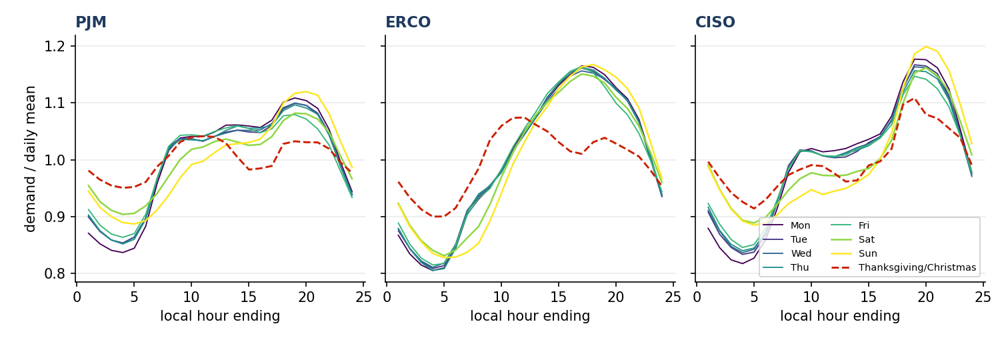
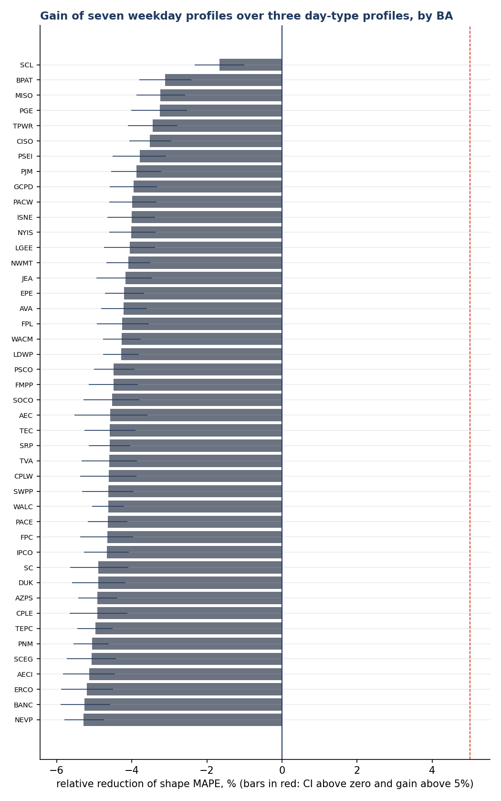
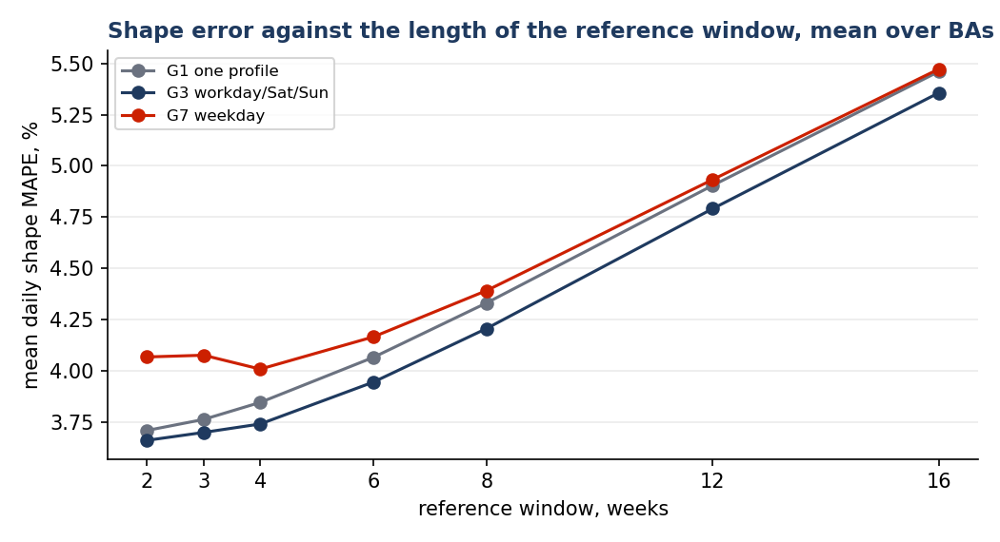
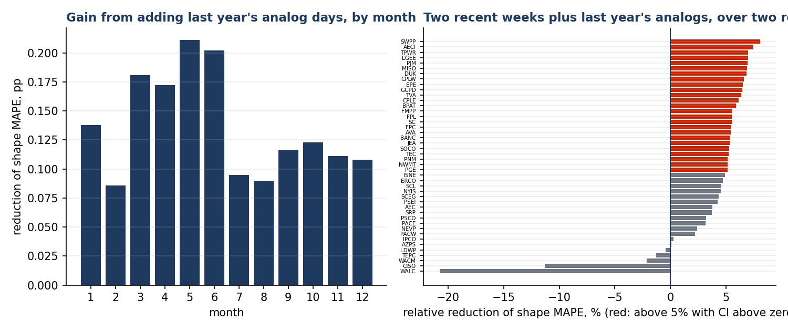
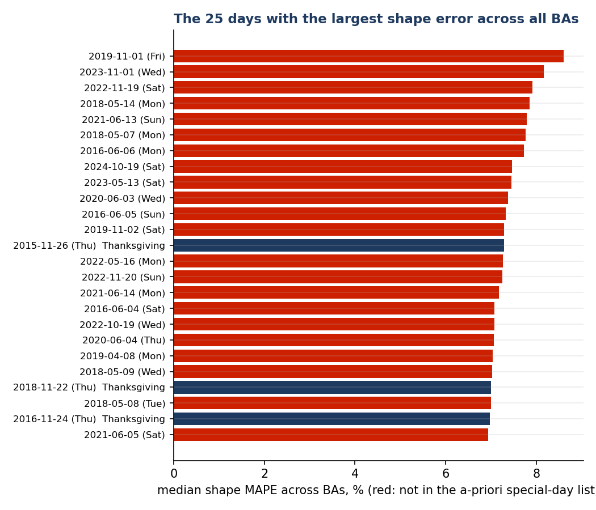
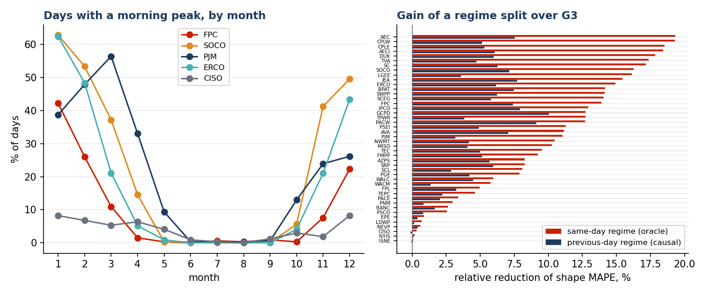
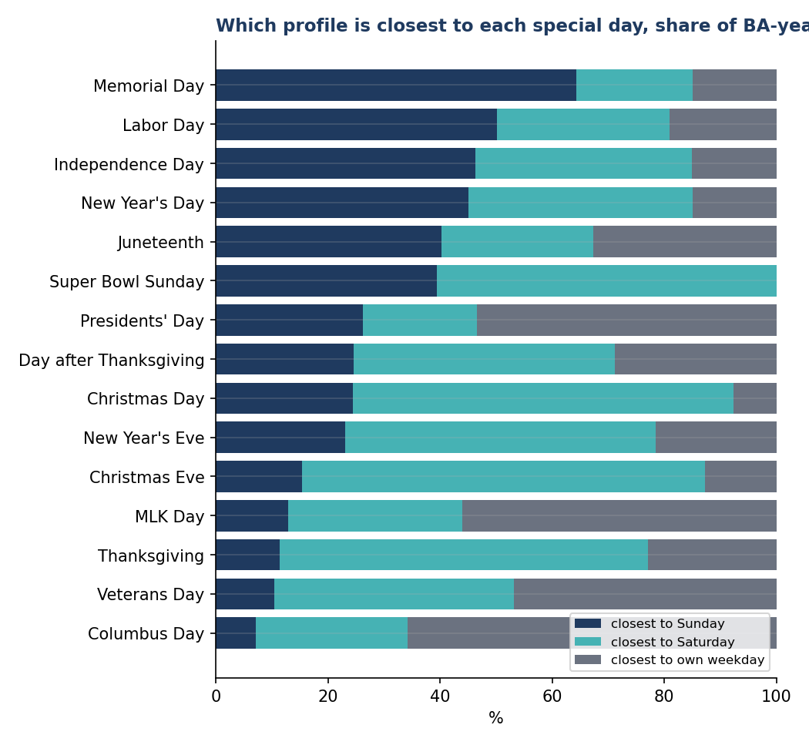
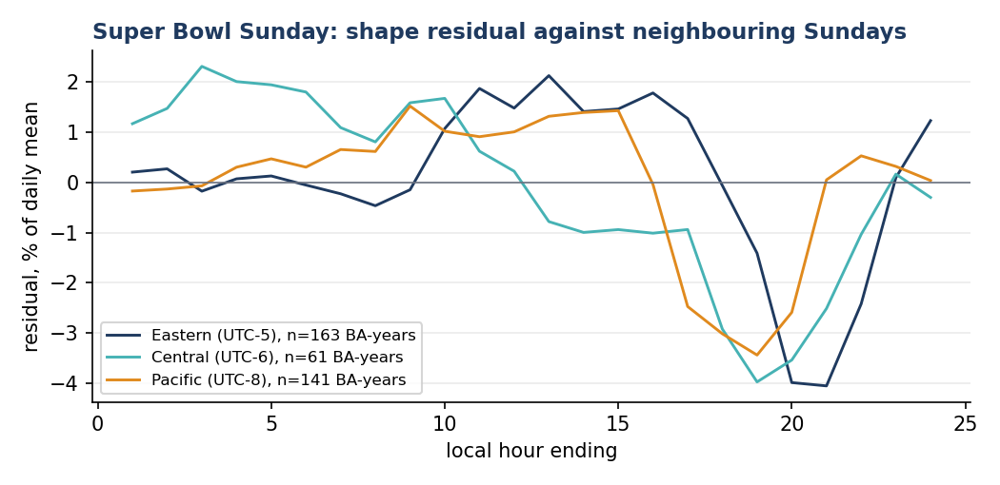

# Seven daily profiles, three, or none? What ten years of U.S. grid data say about Mondays, holidays and the first cold morning of the year

*A plain-language version of Cardinal Grid Note 2. The numbers come from the same code and the same public data; the full note, with methods and tables, is [here](README.md).*

---

Every electric grid has a daily rhythm. Demand is low at 4 a.m., climbs when people wake up, plateaus through the working day, peaks when they get home, and falls again after dinner. Engineers call the shape of that rhythm the **daily load profile**, and they lean on it constantly: to spot a broken sensor (a reading that does not fit the profile), to fill a gap in the data (borrow the profile), and to forecast tomorrow (start from the profile).

So a very practical question comes up in every control room and every forecasting model: **how many profiles do you need?** One school of thought keeps seven, one per weekday, because Monday is not Wednesday. Another keeps three: a working day, a Saturday, a Sunday. Both agree that holidays need special treatment.

I wanted the answer for the whole United States at once. Since 2015 every U.S. **balancing authority**, the organisation that keeps supply and demand in balance in a region, from giants like PJM and ERCOT to a single municipal utility, has reported its hourly demand to the federal government. That is {n_bas} operators, {ba_days} operator-days, ten years, all public. Here is what it says.

## First, what a "profile" looks like

Divide each hour of a day by the day's average and you get the *shape* of the day, with the size removed. A cold January Tuesday and a mild April Tuesday have very different sizes but similar shapes. Below are the long-run shapes of the seven weekdays for three big operators, with Thanksgiving and Christmas dashed in red.

Look at the working days: five lines, almost on top of each other. Monday dips a little lower in the early morning, Friday evening is a touch lighter. Saturday and Sunday are visibly different, with a lazy start. And the holidays are something else entirely.

## Finding 1: seven profiles lose to three. Everywhere.

I built profiles the way an operator would have to: for each day, using only days *before* it. Then I measured how well each profile predicted the shape of the day. Seven weekday profiles were **worse** than three day-type profiles in every single one of the {n_bas} operators, by about {g7_loss} on average.

How can Monday have its own personality and still not deserve its own profile? Because the personality is tiny. Tuesday, Wednesday and Thursday differ from each other by about {idx_tue_wed} of the day-to-day noise, and Monday from mid-week by {idx_mon_thu}. To estimate Monday's profile you can only use Mondays, which means one day per week instead of five. You throw away 80% of your data to capture a difference smaller than the random wobble between two ordinary Tuesdays. Bad trade.

I also tried the obvious compromise, a three-type profile with a small, stable "Monday correction" learned over a whole year. It helped Mondays by {hyb_mon} percentage points and Fridays by {hyb_fri}, hurt the other days by the same, and changed nothing overall. The Monday signature is real, stable, and irrelevant.

## Finding 2: yesterday matters more than the calendar

Here is the chart that surprised me most.

The horizontal axis is how far back you look when building the profile. The error goes up, steadily, the further back you look. Two weeks beats four, four beats eight, eight beats sixteen. A single profile built from the last three weeks beats three carefully separated profiles built from the last six.

The reason is the season. The shape of a day drifts, all the time: the evening peak arrives later as days lengthen, air conditioning shifts the afternoon, heating shifts the morning. Old data is not more data, it is data about a different season. That is also why seven profiles lose: they *force* you to reach further back.

So should you group days by season instead? I tried that too, and it was the worst idea in the study: fixed seasonal classes were **{s4_loss} worse** than simply using the last two weeks. A "winter profile" built over three months is as stale as a long window.

What *does* help is a smarter use of last year: take the last two weeks, and add the same three weeks from one year ago. Last year's calendar knows something the recent past cannot: it knows that the first cold morning is coming. That combination beat the recent two weeks alone in {r2a1_up} of {n_bas} operators, most of all in spring, when the shape moves fastest.

There are exceptions, and they are instructive. In California ({analog_worst_short}), last year's profile makes things *worse*. The shape there is changing year by year, as rooftop solar carves an ever-deeper hole into midday demand. Last year is no longer a guide.

## Finding 3: the weather beats the calendar

I asked the data a different question: on which days did the most operators, all at the same time, look nothing like their usual selves? I expected Thanksgiving and Christmas. I got this:

Almost none of them are holidays. They are dates like 1 November 2019, 1 November 2023, 14 May 2018: the first cold morning of autumn and the first hot afternoon of spring. On those days, across the whole Southeast, the daily peak jumps from 6 p.m. to 7 a.m., or back, because millions of electric heaters switch on at once, or millions of air conditioners do. No calendar knows that. The weather does.

The left panel shows how common a "morning-peak day" is through the year for five operators. In Florida, Georgia and the Carolinas, more than 40% of December and January days peak in the morning. In California, New York and New England, almost none do; their winters run on gas. The right panel shows what you gain by treating "heating day" and "cooling day" as two different day types: up to {regime_top_gain} less error in the Southeast, {regime_oracle} on average if you know today's weather, and still {regime_prev} if all you know is what yesterday was like.

For anyone building an anomaly detector this is the headline: **a detector that compares readings with a calendar profile will raise its loudest alarm of the year on the first cold morning**, and that alarm is wrong. The readings are real. The profile is what is missing something.

## Finding 4: which holidays are actually special

Not all holidays are equal, and the data sorts them into three neat piles.

- **Thanksgiving, Christmas Day, Christmas Eve and New Year's Eve look like Saturdays.** People sleep in, and then the house is full and the ovens are on until late. A Sunday is quieter in the evening; a Saturday is not.
- **Memorial Day, Labor Day and the Fourth of July look like Sundays.** Long-weekend days, outdoors, lighter evenings.
- **Martin Luther King Day, Presidents' Day, Columbus Day and Veterans Day are not special at all.** Most of the economy works. Their best profile is an ordinary weekday, and treating them as holidays would make your model worse.

And then there is the Super Bowl.

During the game, demand drops 3 to 4% below a normal Sunday evening, as if a small city had gone dark. And you can see the country's time zones in the data: the dip lands at 8 to 9 p.m. on the East Coast and at 6 to 7 p.m. on the Pacific, exactly when kick-off happens on each local clock. Ten years of grid data contain the NFL schedule.

## What to actually do

If you build anything on top of daily load profiles in the U.S., the evidence points one way:

1. **Three day types, not seven.** Workday, Saturday, Sunday.
2. **Look back two weeks, plus the same three weeks of last year.** Not a fixed season. Not a long window.
3. **A short holiday list**, mapped to a Saturday or Sunday profile as above, and nothing for the four minor federal holidays.
4. **Add the weather.** A heating-versus-cooling day type, from a temperature forecast if you have one, from yesterday if you do not.

## Where this comes from

All of this is computed from the public EIA-930 files by an open script, and every number in this text is written by that script. The full note, with the methods, the confidence intervals and the tables, is in the same repository. Nothing here uses any operator's private data, and no operator was contacted.

*Ricardo Guerra, Cardinal Grid, an independent open initiative. Generated {generated}.*
